# module_init

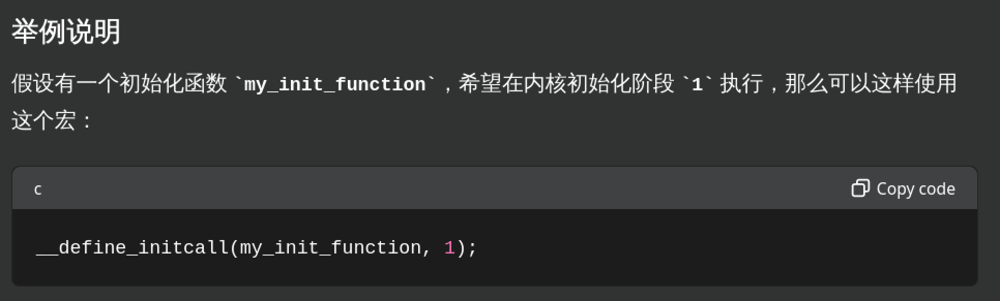

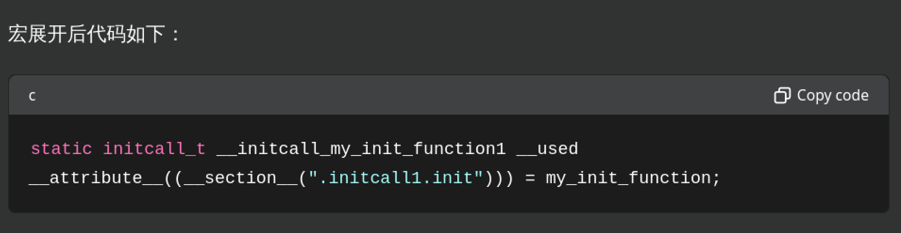

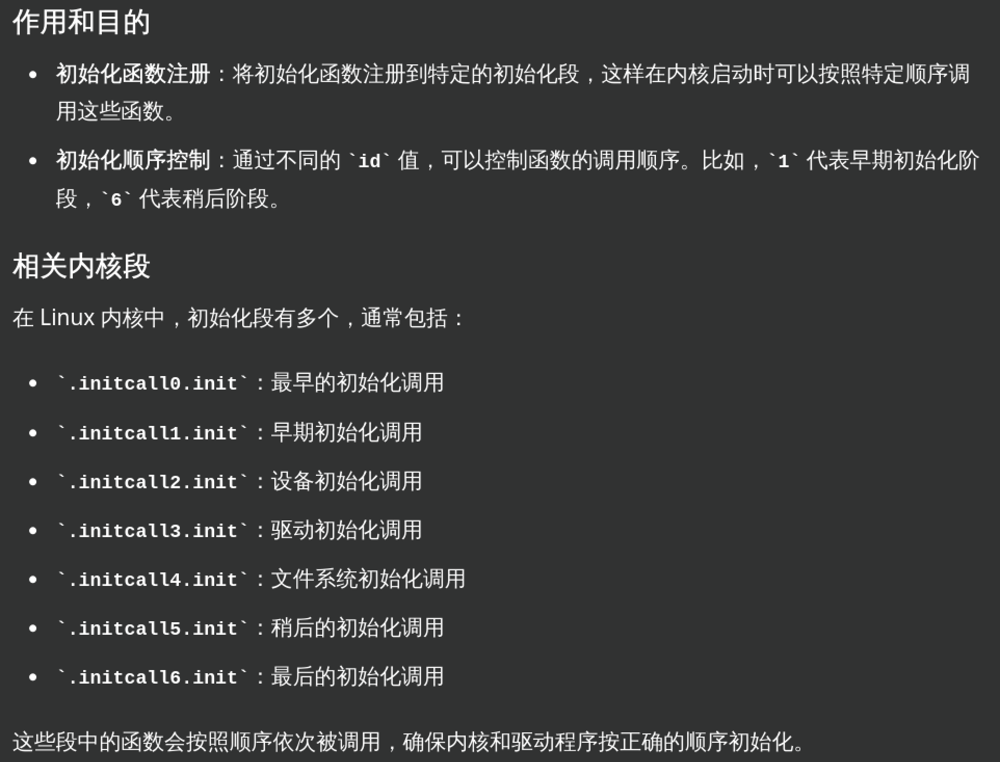

其中：

最终这里定义了一个函数指针，名字为\_\_initcall\_##fn##id，返回值类型为int参数为空

那么\_initcall\_##fn##id在哪里调用

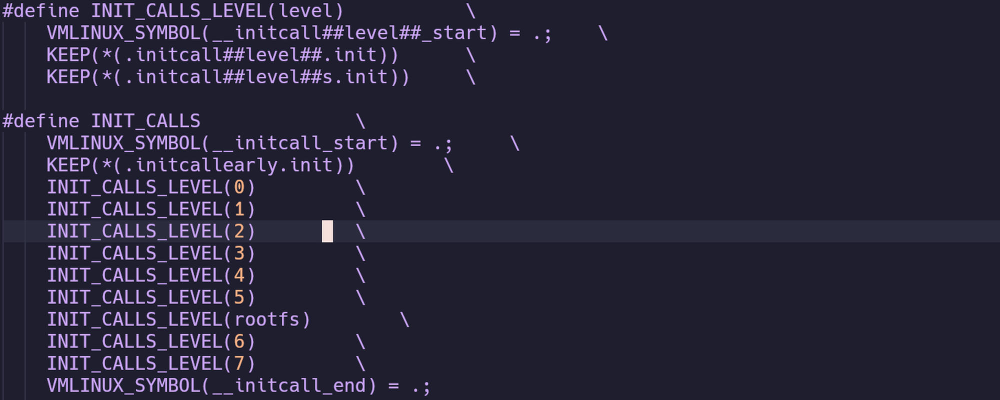

在这里生成了lds连接文件，加上\_start记录了每个段开始的位置

这些start什么时候使用呢，init/main.c

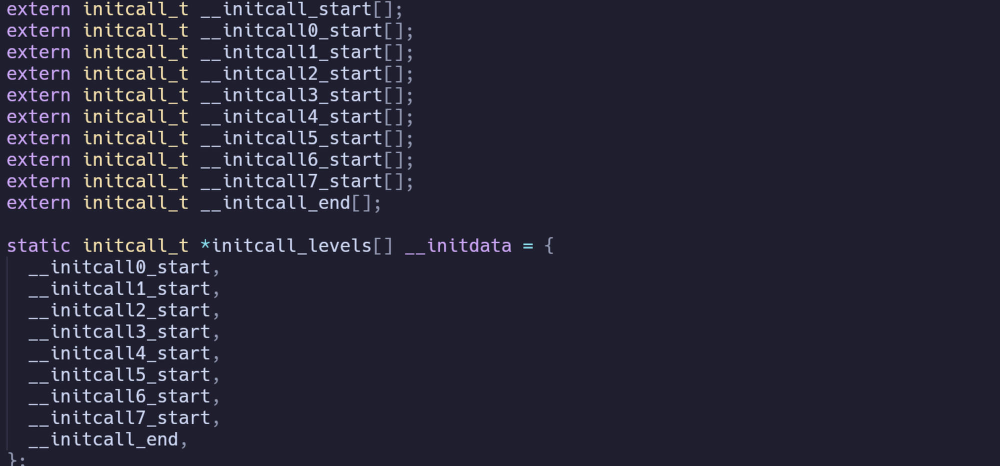

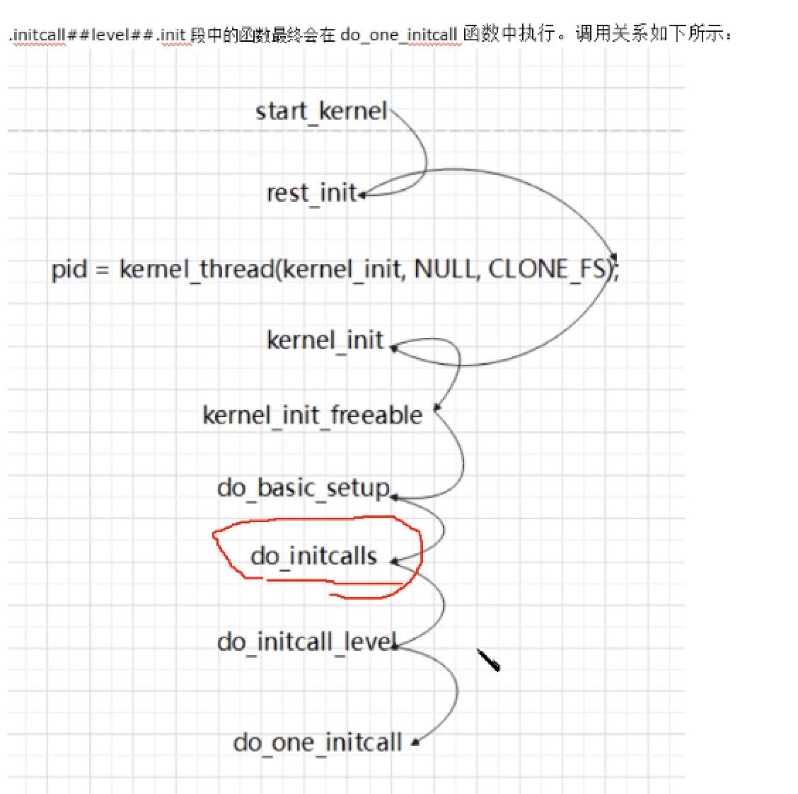

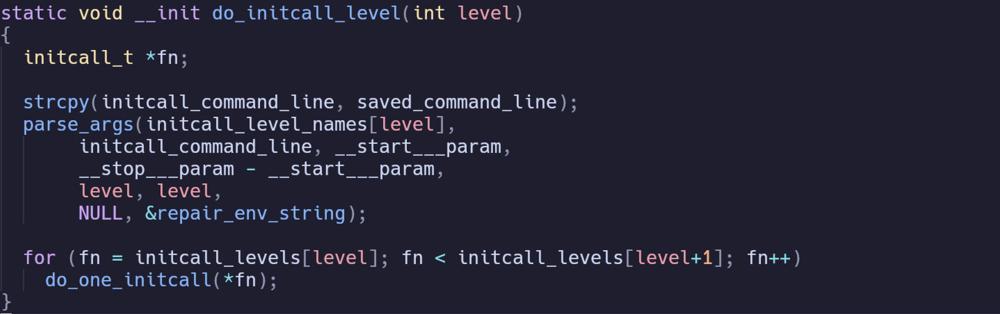

ok,闭环了

最终在这里执行

以上是在noModules的情况在，在MODULE情况下不一样  
 

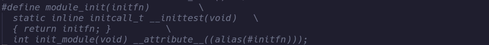

此时的module\_init的定义就变了，alias表示给initfn起了个别名，这样所有module\_init(fn)中的fn经过变化就都变成init\_module了，那么哪里使用init\_module呢  
模块编译文件夹下会有一个同名的mod.c文件例如hello\_drv.mod.c

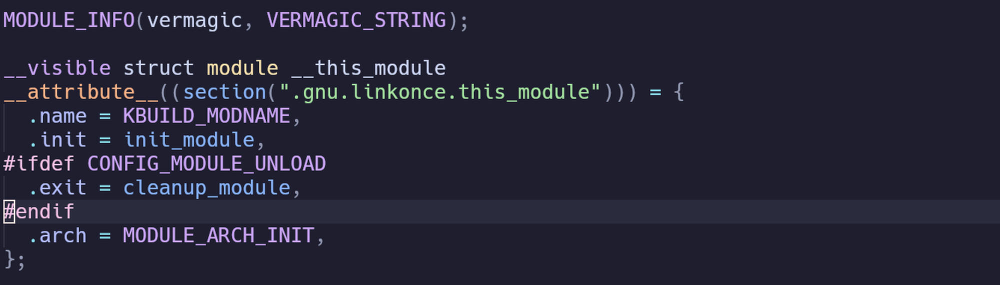

这里有\_\_this\_module中的.init = init\_module

那么\_\_this\_module中的init在哪里调用

那肯定要去加载module的系统调用

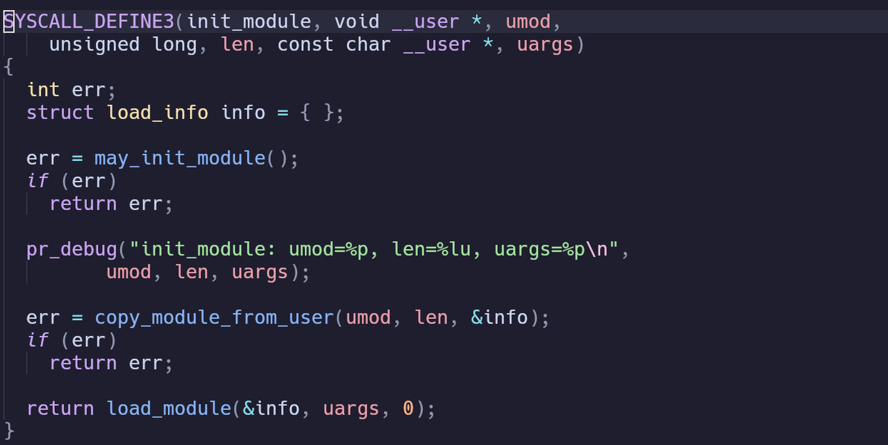

核心是load\_module函数

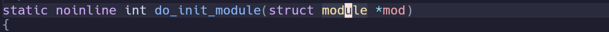

这里mod也是struct module

所以符合

这里就调用了模块里面编写的init函数也就是module\_init(fn)中的fn