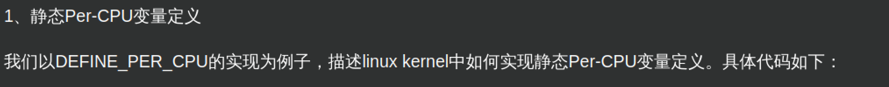

# per_cpu
[http://www.wowotech.net/kernel\_synchronization/per-cpu.html](http://www.wowotech.net/kernel_synchronization/per-cpu.html)

https://www.dingmos.com/index.php/archives/16/

具体来看一看副本是如何复制出来的，关键就是这个函数

这个函数在start\_kernel中调用

其中的\_\_per\_cpu\_offset保存了全部cpu的偏移量