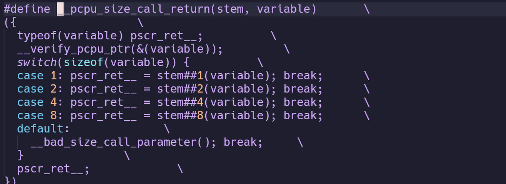

# soft_interrupt
_开启一个软中断_

打开一个软中断就是设置一个软中断向量表的某一位为一个函数

软中断向量表的定义

既然是软中断向量表，那么很容易想到这个表中的每个元素都是一个函数，查看softirq\_action

果然和猜想的一样

NR\_SOFTIRQS为软中断的个数

_唤醒一个软中断_

or\_softirq\_pending将相应的位设置为1,表示该软中断触发

local\_softirq\_pending\_ref定义在

其中irq\_stat

\_\_PCPU\_ATTRS设置attribute将变量放入指定段中，这里是“.data..percpu"加sec

上一步中的sec传入了PER\_CPU\_ALIGNED\_SECTION

就是放入到.data..percpu..shared\_aligned

type就是irq\_cpustat\_t ，name就是irq\_stat

所以irq\_stat是irq\_cpustat\_t类型，且放入到.data..percpu..shared\_aligned这个段中，

这个类型中有个\_\_softirq\_pending变量  
最终

就是为irq\_stat.\_\_sofrirq\_pending起了一个别名

这里的stem是raw\_cpu\_or\_   根据local\_softirq\_pending\_ref也就是irq\_stat.\_\_softirq\_pending的大小定义一个函数例如raw\_cpu\_or\_8(irq\_stat.\_\_soft\_pending,(x));

这个函数的作用是对irq\_stat.\_\_soft\_pending或上orx,x表示的是软中断需要至为1的位

这里展开就是 

展开

精简一下

其中RELOC\_HIDE  
 

解释一下就是根据地址ptr加上off偏移计算地址

不能继续往下深究了，太麻烦啦，总之这里找到每个cpu对应的软中断位，设置其为1

_softirqd线程_

softirqd就是根据软中断向量表处理相应函数的内核线程

找到ksoftirqd线程，wakeup这个线程

ksoftirqd 在这里定义，详细请看per\_cpu 这一节

这里有个相似的函数\_\_this\_cpu\_read

这个数组在这里初始化

这个图片的最后一行看到这个初始化函数在start\_kernel中调用

PER\_CPU这部分，详细讲解在PER\_CPU