# wait_queue
等待队列有等待队列头与等待队列元素组成

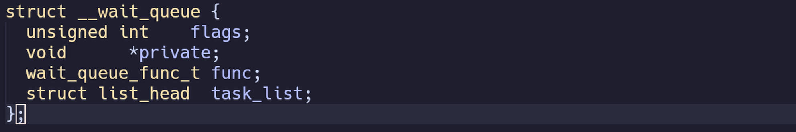

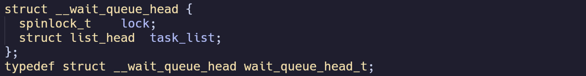

创建等待队列项

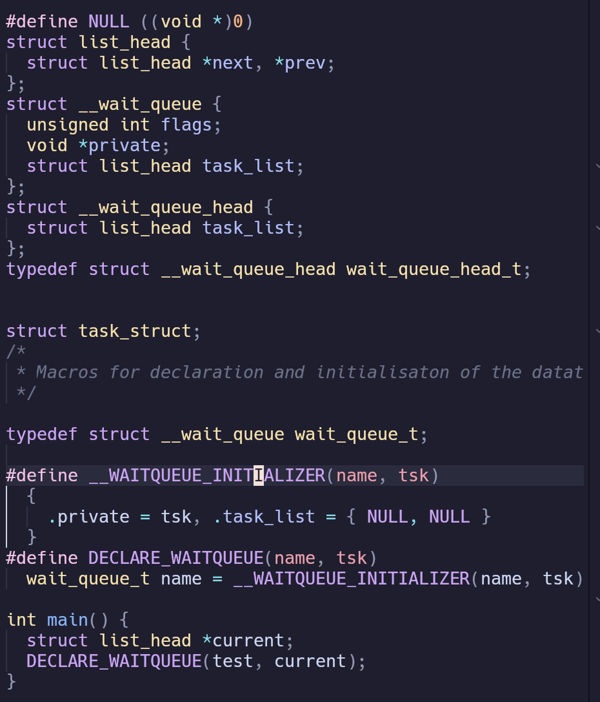

这是各测试代码，预编译以后为

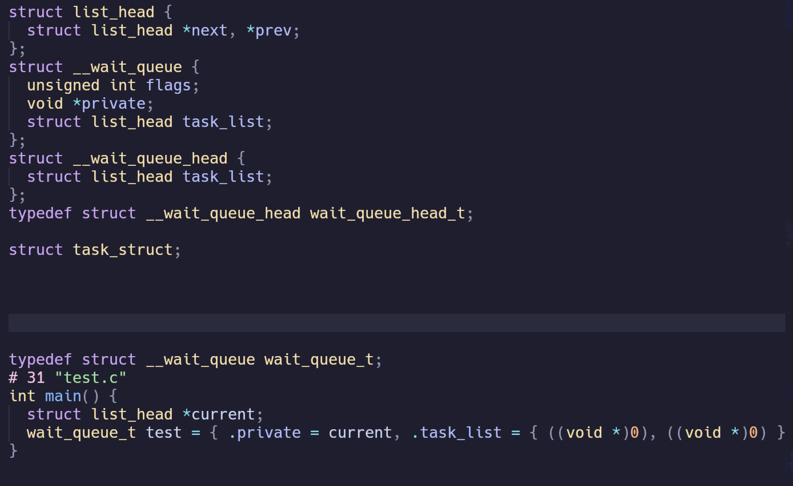

可以看出等待队列项wait\_queue\_t的private指向了current进程

等待队列头的创建

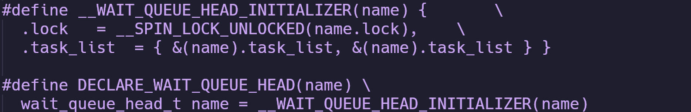

展开是

向等待头加入等待项

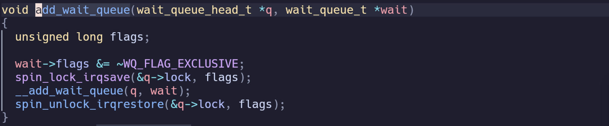

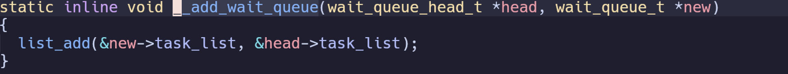

等待事件发生

不可中断阻塞

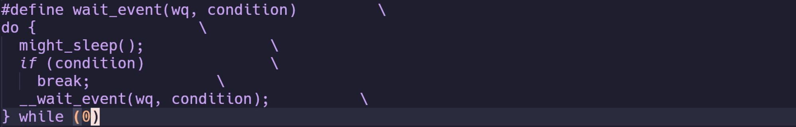

might\_sleep有可能为空

如果条件成立不需要加入直接break

这里先讲一下do{}while(0)

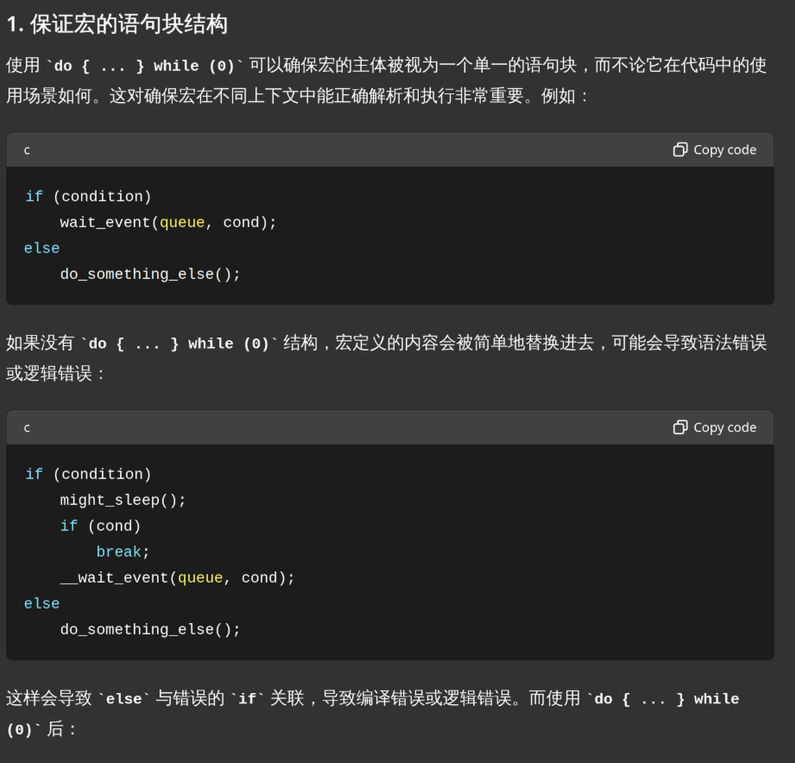

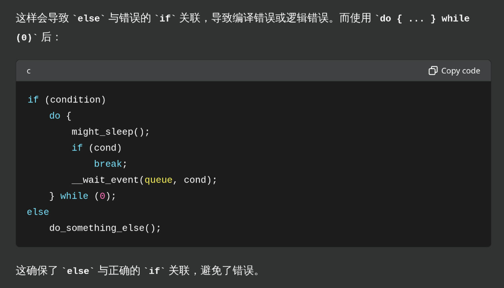

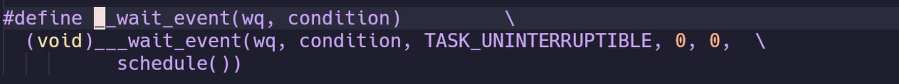

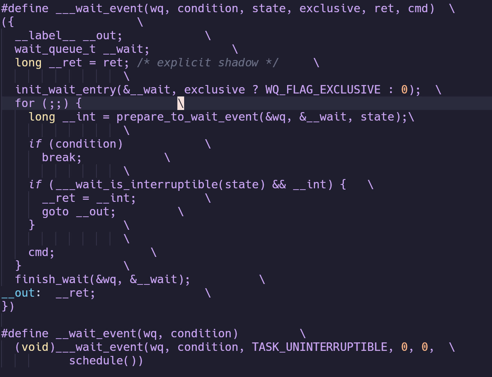

这里的({})是一个复合语句表达式

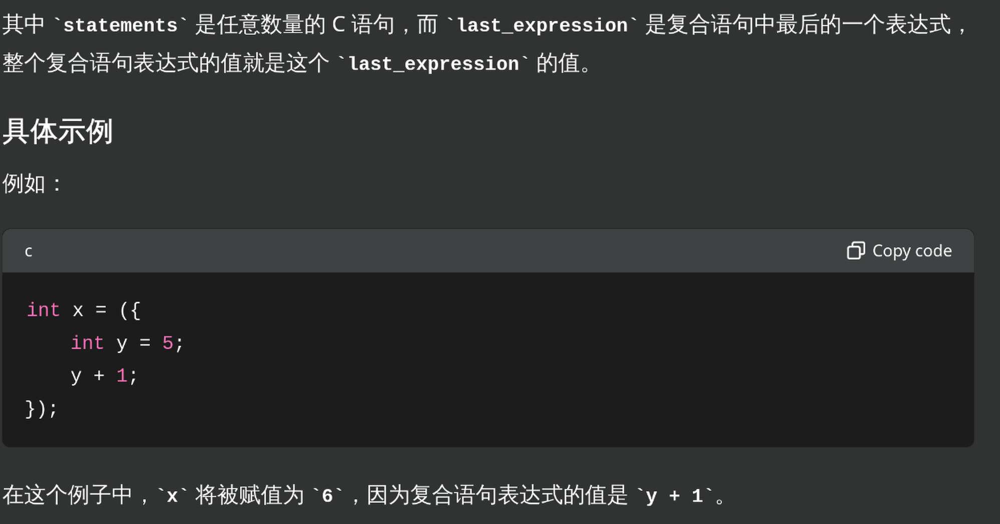

为了便于理解精简

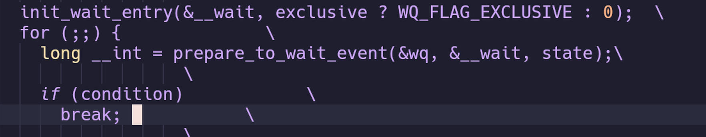

首先定义一个等待项，

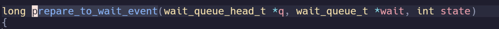

将等待项加入等待队列

判断条件是否满足，是break,就可以进行该进程

否则这里的cmd为shedule()进入进程调度

接下来看wake\_up

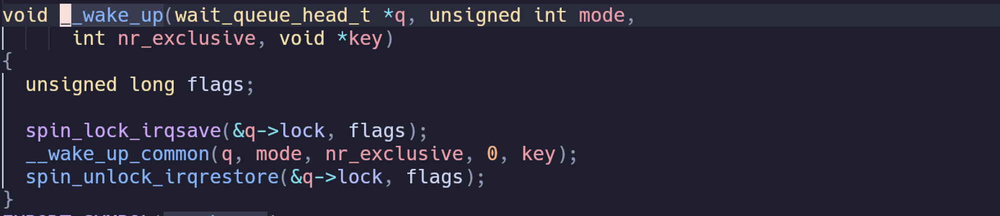

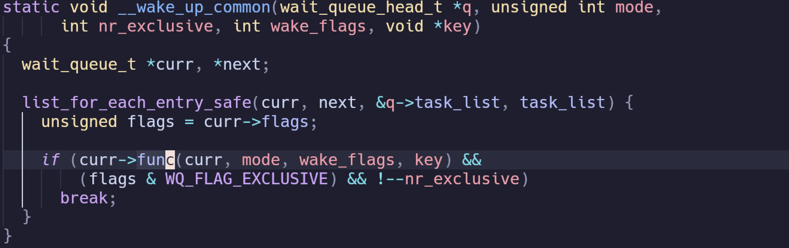

这里的func就是当初初始化等待队列项的

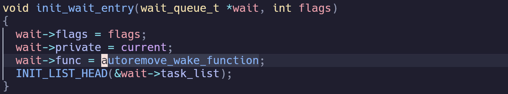

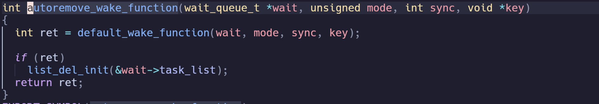

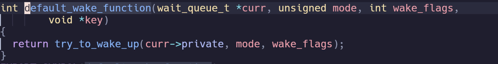

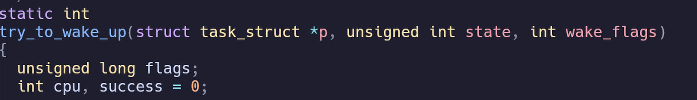

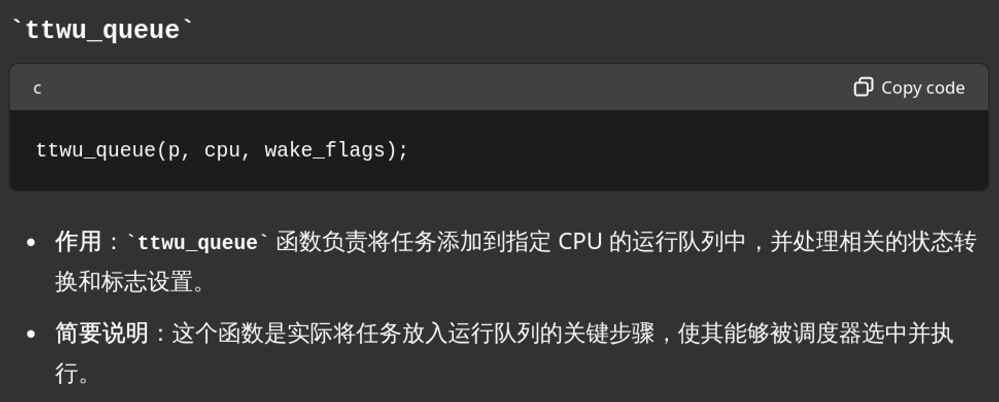